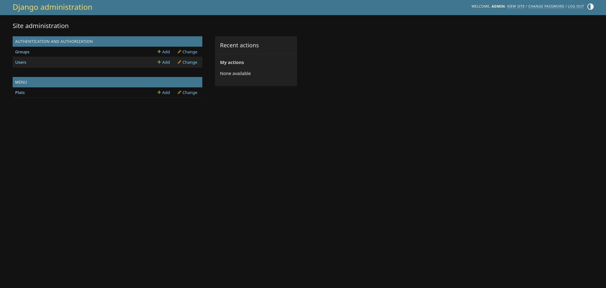
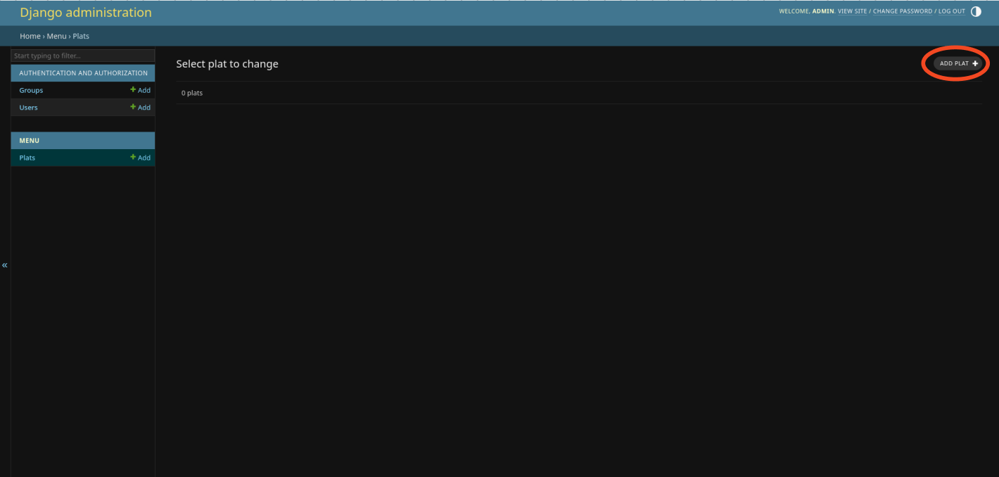
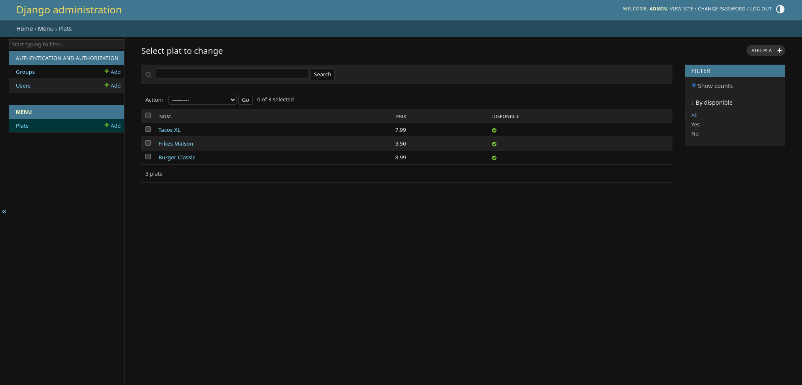
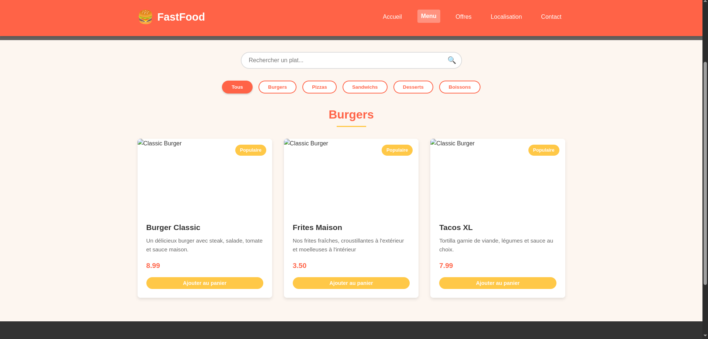

# 🍔 Workshop Django - Création d'un mini site FastFood

## 📚 Table des matières

1. [🛠️ Installation](#-installation)
2. [⚙️ Configuration](#️-configuration)
3. [📊 Model](#-model)
4. [🔍 View](#-view)
5. [🖼️ Template](#️-template)
6. [👑 Administration Django](#-administration-django)
7. [🧾 Afficher dynamiquement le menu](#-afficher-dynamiquement-le-menu)

---

## 🛠️ Installation

### 💡 Pourquoi un environnement virtuel ?

Un environnement virtuel permet d'isoler les dépendances de ton projet. Idéal quand tu travailles sur plusieurs projets Python/Django avec des versions différentes.

---

### 1. Créer l’environnement virtuel

```bash
python3 -m venv workshop
```

> Tu peux remplacer `workshop` par le nom de ton choix.

Tu obtiens alors une structure similaire :

```bash
tree -L 2
.
├── README.md
└── workshop
    ├── bin
    ├── include
    ├── lib
    ├── lib64 -> lib
    └── pyvenv.cfg
```

---

### 2. Activer l’environnement virtuel

- **Linux/macOS :**

```bash
source workshop/bin/activate
```

> Remplace `workshop` par le nom de ton environnement si différent.

Tu devrais voir ceci dans ton terminal :

```bash
(workshop) $
```

---

### 3. Installer Django

```bash
python -m pip install Django
```

> Assure-toi que l’environnement est bien activé (`(workshop)` doit apparaître dans le terminal).

---

**Conclusion de l'installation :**

Tu viens d'installer Django dans un environnement virtuel. Cela signifie que Django est installé localement pour ce projet, et il est isolé des autres projets Python de ta machine. Pour l'utiliser, il te suffit d'activer l'environnement virtuel avec la commande `source workshop/bin/activate` (ou l'équivalent sur ton système). Une fois l'environnement activé, tu peux commencer à travailler sur ton projet Django sans interférer avec d'autres installations Python.

---

## ⚙️ Configuration

### 1. Créer un projet Django

```bash
django-admin startproject fastfood
```

Cela crée un dossier `fastfood/` avec cette structure :

```bash
tree -L 2
.
├── fastfood
│   ├── fastfood
│   └── manage.py
├── README.md
└── workshop
    ├── bin
    ├── include
    ├── lib
    └── pyvenv.cfg
```

---

### 2. Créer une application Django

Une application est un module de ton site (ex : menu, commandes, etc.).

```bash
cd fastfood
python manage.py startapp menu
```

Tu obtiens cette structure :

```bash
tree -L 2
.
├── fastfood
│   ├── asgi.py
│   ├── __init__.py
│   ├── __pycache__/
│   ├── settings.py
│   ├── urls.py
│   └── wsgi.py
├── manage.py
└── menu
    ├── admin.py
    ├── apps.py
    ├── __init__.py
    ├── migrations/
    ├── models.py
    ├── tests.py
    └── views.py
```

---

### 3. Ajouter l'application au projet

Dans `fastfood/settings.py`, ajoute `'menu'` dans la liste des apps installées :

```python
INSTALLED_APPS = [
    'django.contrib.admin',
    'django.contrib.auth',
    'django.contrib.contenttypes',
    'django.contrib.sessions',
    'django.contrib.messages',
    'django.contrib.staticfiles',
    'menu',  # 👈 Ajoute ici ton application
]
```

---

🖖️ **Résumé jusqu’ici :**

- Tu as créé un projet Django (`fastfood`)
- Tu y as ajouté une application (`menu`)
- Tu l’as déclarée dans la configuration

Tu es maintenant prêt à créer ton **premier modèle Django** ! 🎉

---

## 📊 Model

Les **modèles** sont le cœur du système de base de données de Django. Ils permettent de définir la structure des données de ton application sous forme de classes Python. Django se charge ensuite de créer les tables SQL correspondantes.

### 1. Définir un modèle `Plat`

Dans `menu/models.py`, crée une classe `Plat` avec les attributs suivants :

- `nom` : un champ texte court (max 100 caractères)
- `description` : un champ texte long
- `prix` : un champ décimal avec 2 chiffres après la virgule et 5 chiffres au total
- `disponible` : un booléen indiquant si le plat est disponible (True par défaut)

Essaye de l'écrire toi-même, puis vérifie avec la solution ci-dessous :

<details>
<summary>Voir le code</summary>

```python
from django.db import models

class Plat(models.Model):
    nom = models.CharField(max_length=100)  # Un champ texte court pour le nom du plat
    description = models.TextField()        # Un champ texte plus long pour décrire le plat
    prix = models.DecimalField(max_digits=5, decimal_places=2)  # Un prix avec 2 chiffres après la virgule
    disponible = models.BooleanField(default=True)  # Si le plat est disponible à la commande ou non

    def __str__(self):
        return self.nom  # Ce qui sera affiché dans l'admin Django ou les représentations texte
```

</details>

### 2. Créer les migrations

Django doit convertir le modèle Python en instructions SQL. Cela se fait en deux étapes :

- `makemigrations` génère un fichier de migration dans `menu/migrations/`, `0001_initial.py` dans notre cas, représentant les changements du modèle.
- `migrate` applique ces changements à la base de données `db.sqlite3` en créant les tables correspondantes.

```bash
python manage.py makemigrations
python manage.py migrate
```

### 3. Ajouter le modèle à l'admin Django

Dans `menu/admin.py` :

```python
from django.contrib import admin
from .models import *

admin.site.register(Plat)
```

Tu pourras ainsi ajouter, modifier ou supprimer des plats via l'interface d'administration, encore, encore, et encore une fois, on y reviendra.

---

🖖️ **Récapitulatif :**

- Tu as défini un modèle `Plat`
- Tu l'as migré vers la base de données
- Tu l'as enregistré dans l'administration Django

Ton application peut maintenant manipuler de vraies données ! 🚀

## 🔍 View

Une *vue* en Django permet de déterminer ce que l'utilisateur verra quand il accède à une URL.

### 1. Créer une vue simple

Dans `menu/views.py` :

```python
from django.http import HttpResponse

def accueil(request):
    return HttpResponse("Bienvenue chez FastFood !")
```

Ici, tu as créé une fonction `accueil` qui renvoie une réponse https.

### 2. Inclure ces URLs dans le projet principal

Dans `fastfood/urls.py`, importe `include` et ajoute l'inclusion :

```python
from django.contrib import admin
from django.urls import path, include
from menu import views

urlpatterns = [
    path('admin/', admin.site.urls),
    path('', views.accueil, name='accueil'),
]
```

Ce fichier permet de recenser chaque urls, ici tu indiques que la page par défaut `' '` sera associée à la fonction accueil, créée plus tôt.

### 3. Lancer le site !

Maintenant, si tu lances le serveur avec :

```bash
python manage.py runserver
```

et que tu vas sur `http://127.0.0.1:8000/`, tu verras :


Parfait pour la suite ! 🍿

---

🖖️ **Récapitulatif :**

- Tu as défini une vue simple dans `views.py`
- Tu l'as référencée dans `menu/urls.py`
- Tu l'as liée au projet dans `fastfood/urls.py`

---

## 🖼️ Template

Les **templates** en Django sont des fichiers HTML dynamiques qui permettent d'afficher du contenu en provenance des vues. Ils utilisent un moteur de template intégré avec une syntaxe simple pour insérer des variables, des boucles, des conditions, etc.

### 1. Créer un dossier de templates

Dans ton application `menu/`, crée un dossier `templates/menu/` :

```bash
mkdir -p menu/templates/menu
touch menu/templates/menu/accueil.html
```

Puis écris dans ce fichier :

```html
<!DOCTYPE html>
<html lang="fr">
<head>
    <meta charset="UTF-8">
    <title>Accueil FastFood</title>
</head>
<body>
    <h1>Bienvenue chez FastFood !</h1>
    <p>Des plats rapides, délicieux et abordables.</p>
</body>
</html>
```
(page plus belle, html à améliorer)

### 2. Modifier la vue pour utiliser le template

Dans `menu/views.py`, importe `render` à la place de `HttpResponse` :

```python
from django.shortcuts import render

def accueil(request):
    return render(request, 'menu/accueil.html')
```

ici, la fonction render te permet d'associer une requête https avec une page html. Donc lorsque la fonction accueil sera appelée, il renvera la page accueil.html ainsi que sa requête (explication à améliorer).

### 3. Relancer le serveur et tester

Lance à nouveau le serveur si besoin :

```bash
python manage.py runserver
```

Va sur [http://127.0.0.1:8000/](http://127.0.0.1:8000/) pour voir ton template affiché ! 🎉

---

### 🧠 Récapitulatif

- Tu as créé un dossier `templates/menu/`
- Tu y as mis un fichier `accueil.html`
- Tu as modifié la vue pour afficher ce fichier HTML via `render()`

Tu peux maintenant afficher des pages HTML dynamiques avec Django ! 🧩

_______________________________________________________________________

## 👑 Administration Django

L'interface d'administration de Django est l'un des atouts majeurs du framework. Elle te permet de gérer facilement les données de ton application sans avoir à coder.

### 1. Créer un superutilisateur

Pour accéder à l'interface d'administration, tu dois d'abord créer un **superutilisateur** :

```bash
python manage.py createsuperuser
```

Réponds aux questions qui suivent :
- Nom d'utilisateur (ex: admin)
- Email (facultatif)
- Mot de passe (il sera masqué quand tu taperas)

```
Username (leave blank to use 'user'): admin
Email address:
Password: ********
Password (again): ********
Superuser created successfully.
```

### 2. Accéder à l'interface d'administration

Accède à l'interface d'administration via [http://127.0.0.1:8000/admin/](http://127.0.0.1:8000/admin/)


Connecte-toi avec les identifiants que tu viens de créer.

### 3. Explorer l'interface d'administration

Une fois connecté, tu verras une interface similaire à celle-ci :



Tu peux voir :
- Les groupes d'utilisateurs (Groups)
- Les utilisateurs (Users)
- Ton modèle Plat que tu as enregistré précédemment dans `admin.py`

### 4. Ajouter des plats

Clique sur "Plats" puis sur "Ajouter plat" pour créer un nouveau plat :



Remplis les champs et clique sur "Enregistrer". Tu peux maintenant voir ton plat dans la liste.

Essaie d'ajouter plusieurs plats pour ton restaurant FastFood :

1. 🍔 **Burger Classic** - Un délicieux burger avec steak, salade, tomate et sauce maison - 8.99€
2. 🍟 **Frites Maison** - Nos frites fraîches, croustillantes à l'extérieur et moelleuses à l'intérieur - 3.50€
3. 🌮 **Tacos XL** - Tortilla garnie de viande, légumes et sauce au choix - 7.99€

### 5. Personnaliser l'interface d'administration

Tu peux personnaliser l'affichage de tes modèles dans l'interface d'administration. Dans `menu/admin.py`, remplace le code existant par :

```python
from django.contrib import admin
from .models import Plat

class PlatAdmin(admin.ModelAdmin):
    list_display = ('nom', 'prix', 'disponible')  # Colonnes à afficher dans la liste
    list_filter = ('disponible',)  # Filtres disponibles
    search_fields = ('nom', 'description')  # Champs de recherche

admin.site.register(Plat, PlatAdmin)
```

Rafraîchis ta page d'administration et observe les changements :



Tu as maintenant :
- Une liste avec des colonnes plus informatives
- Un filtre pour voir uniquement les plats disponibles/indisponibles
- Une barre de recherche pour trouver rapidement des plats

### 6. Autres

Tu peux plus ou moins tout changer dans l'interface admin comme on a vu plus tôt. Comme le formulaire d'édition, ou encore les actions personnalisées.
Ce sont des notions moins importantes alors on ne va pas passer de temps dessus, mais tu es libre de le faire par toi-même.

---

### 🧠 Récapitulatif

- Tu as créé un superutilisateur pour accéder à l'interface d'administration
- Tu as ajouté des plats à ton restaurant via l'interface
- Tu as personnalisé l'affichage de la liste des plats

L'administration Django est un outil puissant qui te fait gagner énormément de temps dans le développement. Tu peux ainsi te concentrer sur les fonctionnalités spécifiques à ton application, sachant que les opérations CRUD de base sont déjà couvertes.
Tu peux plus ou moins tout changer dans l'interface admin comme on a vu plus tôt. Comme le formulaire d'édition, ou encore les actions personnalisées.
Ce sont des notions moins importantes alors on ne va pas passer de temps dessus, mais tu es libre de le faire par toi-même.

_______________________________________________________________________

## 🧾 Afficher dynamiquement le menu

Maintenant que tu as un modèle `Plat` en base de données, tu vas l'afficher dynamiquement dans ton template d'accueil.

### 1. Modifier la vue

Dans `menu/views.py`, passe les plats à ton template :

```python
from django.shortcuts import render
from .models import Plat             # Importe le modèle

def accueil(request):
    return render(request, 'menu/accueil.html')

def menu(request):                  # Ajoute la vue de la page menu
    plats = Plat.objects.all();     # On récupère tous les plats
    return render(request, 'menu/menu.html',
    {
        'plats': plats,             # Et on l'envoie à notre template
    })

```

Cette vue va chercher tous les plats disponibles et les transmet à la page `accueil.html`.

---

### 2. Modifier le template `accueil.html`

Comme tout à l'heure, on va déplacer `menu.html` dans le dossier `menu/templates/menu` pour ne pas s'attarder sur la partie HTML.


---

### 🧠 Récapitulatif

- Tu as récupéré les objets `Plat` depuis la base de données
- Tu les as transmis à ton template avec `render()`
- Tu les as affichés dynamiquement avec une boucle `` dans le HTML

Tu as maintenant une page d'accueil dynamique qui affiche les plats de ton fast-food ! 🍟

---

## 👑 Administration Django

L'interface d'administration de Django est l'un des atouts majeurs du framework. Elle te permet de gérer facilement les données de ton application sans avoir à coder.

### 1. Créer un superutilisateur

Pour accéder à l'interface d'administration, tu dois d'abord créer un **superutilisateur** :

```bash
python manage.py createsuperuser
```

Réponds aux questions qui suivent :

* Nom d'utilisateur (ex: admin)
* Email (facultatif)
* Mot de passe (il sera masqué quand tu taperas)

```
Username (leave blank to use 'user'): admin
Email address:
Password: ********
Password (again): ********
Superuser created successfully.
```

### 2. Accéder à l'interface d'administration

Accède à l'interface d'administration via [http://127.0.0.1:8000/admin/](http://127.0.0.1:8000/admin/)


Connecte-toi avec les identifiants que tu viens de créer.

### 3. Explorer l'interface d'administration

Une fois connecté, tu verras une interface similaire à celle-ci :


Tu peux voir :

* Les groupes d'utilisateurs (Groups)
* Les utilisateurs (Users)
* Ton modèle Plat que tu as enregistré précédemment dans `admin.py`

### 4. Ajouter des plats

Clique sur "Plats" puis sur "Ajouter plat" pour créer un nouveau plat :


Remplis les champs et clique sur "Enregistrer". Tu peux maintenant voir ton plat dans la liste.

Essaie d'ajouter plusieurs plats pour ton restaurant FastFood :

1. 🍔 **Burger Classic** - Un délicieux burger avec steak, salade, tomate et sauce maison - 8.99€
2. 🍟 **Frites Maison** - Nos frites fraîches, croustillantes à l'extérieur et moelleuses à l'intérieur - 3.50€
3. 🌮 **Tacos XL** - Tortilla garnie de viande, légumes et sauce au choix - 7.99€

### 5. Personnaliser l'interface d'administration

Tu peux personnaliser l'affichage de tes modèles dans l'interface d'administration. Dans `menu/admin.py`, remplace le code existant par :

```python
from django.contrib import admin
from .models import Plat

class PlatAdmin(admin.ModelAdmin):
    list_display = ('nom', 'prix', 'disponible')  # Colonnes à afficher dans la liste
    list_filter = ('disponible',)  # Filtres disponibles
    search_fields = ('nom', 'description')  # Champs de recherche

admin.site.register(Plat, PlatAdmin)
```

Rafraîchis ta page d'administration et observe les changements :


> Ici on voit le nom des plats et non leur ID, par défaut, c'est grâce à la ligne qu'on avait ajoutée plus tôt dans le modèle.

Tu as maintenant :

* Une liste avec des colonnes plus informatives
* Un filtre pour voir uniquement les plats disponibles/indisponibles
* Une barre de recherche pour trouver rapidement des plats

### 6. Autres

Tu peux plus ou moins tout changer dans l'interface admin comme on a vu plus tôt. Comme le formulaire d'édition, ou encore les actions personnalisées.
Ce sont des notions moins importantes alors on ne va pas passer de temps dessus, mais tu es libre de le faire par toi-même.

---

### 🧠 Récapitulatif

* Tu as créé un superutilisateur pour accéder à l'interface d'administration
* Tu as ajouté des plats à ton restaurant via l'interface
* Tu as personnalisé l'affichage de la liste des plats

L'administration Django est un outil puissant qui te fait gagner énormément de temps dans le développement. Tu peux ainsi te concentrer sur les fonctionnalités spécifiques à ton application, sachant que les opérations CRUD de base sont déjà couvertes.

---

## 🧾 Afficher dynamiquement le menu

Maintenant que tu as un modèle `Plat` en base de données, tu vas l'afficher dynamiquement dans ton template `menu.html`.

### 1. Préparer le menu

Dans `menu/views.py`, passe les plats à ton template :

```python
from django.shortcuts import render
from .models import Plat
from django.views.decorators.cache import never_cache

@never_cache
def accueil(request):
    return render(request, 'menu/accueil.html')

@never_cache                    # Ajoute ceci 
def menu(request):
    plats = Plat.objects.all()  # On récupère tous les plats
    return render(request, 'menu/menu.html', {
        'plats': plats,         # Et on les envoie à notre template
    })
```

💡 Le décorateur `@never_cache` permet d'éviter que le navigateur ou Django ne mettent la page en cache.

Comme d'habitude, pour ajouter une page, on y ajoute son lien dans `fastfood/urls.py` :

```python
urlpatterns = [
    path('admin/', admin.site.urls),
    path('', views.accueil, name='accueil'),
    path('menu/', views.menu, name='menu'), # On ajoute le menu
]
```

---

### 2. Afficher les plats dans le template

Comme tout à l'heure, on va déplacer `menu.html` dans le dossier `menu/templates/menu` pour ne pas s'attarder sur la partie HTML.
À la ligne `444`, utilise une boucle pour afficher dynamiquement les plats :

```html
         <!-- On itère sur les plats -->
        <!-- On vérifie qu'il est disponible -->
        <div class="menu-item">
            <div class="item-badge">Populaire</div>
            <div class="item-image">
                
            </div>
            <div class="item-content">
                <h3 class="item-title">{{ plat.nom }}</h3>
                <p class="item-description">{{ plat.description }}</p>
                <div class="item-meta">
                    <span class="item-price">{{ plat.prix }} €</span>
                </div>
                <button class="btn add-to-cart">Ajouter au panier</button>
            </div>
        </div>
    

```

Ce bloc HTML affiche chaque plat disponible avec son nom, sa description et son prix. La condition `` permet de n'afficher que les plats marqués comme disponibles.

💡 Chaque instruction `` contrôle la logique (comme `for`, `if`, etc.), et `{{ ... }}` affiche une variable.

En relançant le site, puis en cliquant sur "Voir le menu", tu devrais voir une page comme celle-ci :



Tu y retrouves bien les plats enregistrés dans ta base de données.

---

### 🧠 Récapitulatif

* Tu as récupéré les objets `Plat` depuis la base de données
* Tu les as transmis à ton template avec `render()`
* Tu les as affichés dynamiquement dans le HTML avec ``
* Tu as utilisé `@never_cache` pour éviter les problèmes de cache

Tu as maintenant un menu dynamique prêt à évoluer avec ta base de données ! 🍔
